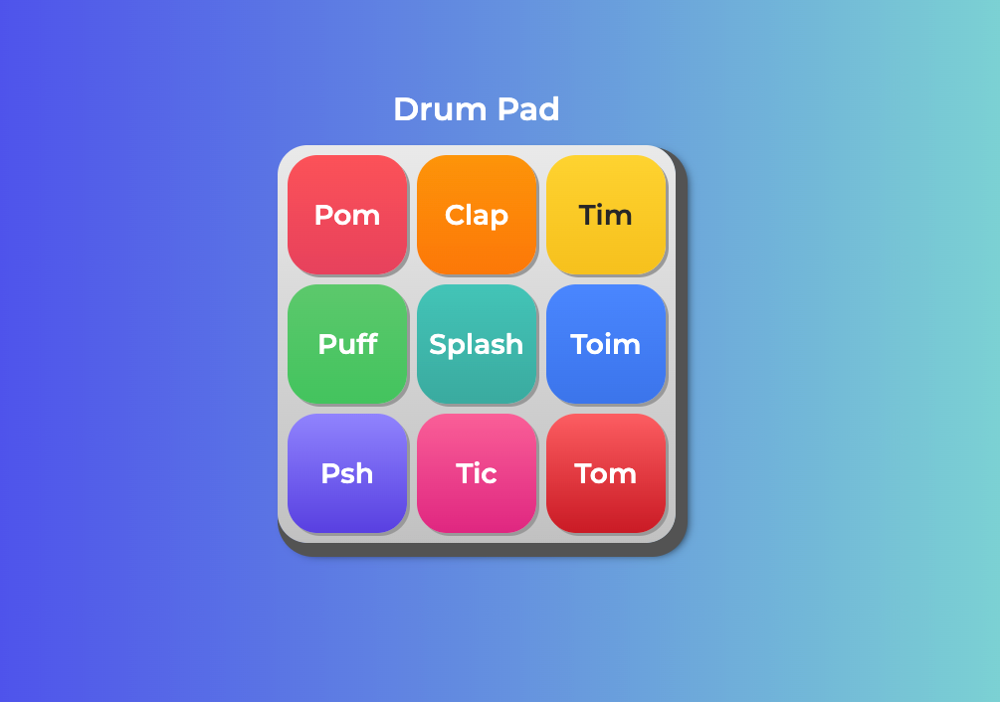

# 🥁 Alura MIDI

Batería electrónica interactiva desarrollada con HTML, CSS y JavaScript. Un pad MIDI virtual que reproduce sonidos de percusión al hacer clic o usar el teclado.



## 🎵 Descripción

Alura MIDI es una aplicación web que simula un controlador MIDI de batería electrónica, similar a dispositivos como el Akai MPD o Novation Launchpad. Cuenta con 9 pads interactivos, cada uno con su propio sonido de percusión.

## ✨ Características

- 🎹 **9 pads de percusión** con sonidos únicos
- 🖱️ **Control con mouse**: Haz clic en cualquier pad para reproducir el sonido
- ⌨️ **Control con teclado**: Usa Espacio o Enter cuando un pad esté enfocado
- 🎨 **Interfaz colorida** con feedback visual
- 📱 **Diseño responsive** adaptable a diferentes pantallas

## 🚀 Demo

Simplemente abre el archivo `index.html` en tu navegador favorito.

## 📁 Estructura del proyecto
```
aluramidi/
├── css/
│   ├── estilos.css      # Estilos principales
│   └── reset.css        # Reset de estilos del navegador
├── images/
│   └── bateria.png      # Ícono de la aplicación
├── sounds/
│   ├── keya.wav         # Sonido Puff
│   ├── keyc.wav         # Sonido Tom
│   ├── keyd.wav         # Sonido Toim
│   ├── keye.wav         # Sonido Tim
│   ├── keyq.wav         # Sonido Pom
│   ├── keys.wav         # Sonido Splash
│   ├── keyw.wav         # Sonido Clap
│   ├── keyx.wav         # Sonido Tic
│   └── keyz.wav         # Sonido Psh
├── index.html           # Página principal
└── main.js              # Lógica de la aplicación
```

## 🎮 Cómo usar

1. **Clone el repositorio**
```bash
   git clone https://github.com/tuusuario/aluramidi.git
   cd aluramidi
```

2. **Abra el archivo**
   - Simplemente abre `index.html` en tu navegador
   - No requiere instalación ni dependencias

3. **Interactúa con los pads**
   - Haz clic en cualquier pad para reproducir su sonido
   - Usa Tab para navegar entre pads
   - Presiona Espacio o Enter para activar el pad seleccionado

## 🎨 Pads disponibles

| Pad | Sonido | Archivo |
|-----|--------|---------|
| Pom | Bombo | keyq.wav |
| Clap | Palmada | keyw.wav |
| Tim | Tom agudo | keye.wav |
| Puff | Efecto | keya.wav |
| Splash | Platillo splash | keys.wav |
| Toim | Tom medio | keyd.wav |
| Psh | Hi-hat cerrado | keyz.wav |
| Tic | Clave | keyx.wav |
| Tom | Tom grave | keyc.wav |

## 🛠️ Tecnologías utilizadas

- **HTML5**: Estructura y elementos de audio
- **CSS3**: Estilos y animaciones
- **JavaScript**: Lógica de interacción y reproducción de audio
- **Google Fonts**: Tipografía Montserrat

## 📝 Funcionalidades del código

### JavaScript (`main.js`)
```javascript
// Reproduce el sonido del pad
function playSonido(idElementoAudio) {
    document.querySelector(idElementoAudio).play();
}

// Configura eventos para cada tecla
const listaDeTeclas = document.querySelectorAll('.tecla');
for(let contador = 0; contador < listaDeTeclas.length; contador++){
    const tecla = listaDeTeclas[contador];
    const instrumento = tecla.classList[1];
    const idAudio = `#sonido_${instrumento}`;
    
    // Evento click
    tecla.onclick = function (){
        playSonido(idAudio);
    };
    
    // Evento teclado
    tecla.onkeydown = function(evento){
        if (evento.code === 'Space' || evento.code === 'Enter'){
            tecla.classList.add('activa');
        }
    }
    
    tecla.onkeyup = function(){
        tecla.classList.remove('activa');
    }
}
```

## 🎨 Personalización

### Cambiar colores de los pads

Edita `css/estilos.css` y agrega estilos específicos para cada tecla:
```css
.tecla_pom {
  background-color: #ff6b6b;
  color: white;
}
```

### Agregar nuevos sonidos

1. Agrega el archivo de audio en la carpeta `sounds/`
2. Crea un nuevo botón en `index.html`
3. Agrega el elemento `<audio>` correspondiente
4. El JavaScript automáticamente detectará el nuevo pad

## 🤝 Contribuciones

Las contribuciones son bienvenidas. Para cambios importantes:

1. Haz fork del proyecto
2. Crea una rama para tu feature (`git checkout -b feature/NuevaCaracteristica`)
3. Commit tus cambios (`git commit -m 'Agrega nueva característica'`)
4. Push a la rama (`git push origin feature/NuevaCaracteristica`)
5. Abre un Pull Request

## 📜 Licencia

Este proyecto es parte del programa educativo de [Alura Latam](https://www.aluracursos.com/).

## 👨‍💻 Autor

Desarrollado como parte del curso de Alura LATAM - Lógica de Programación

## 🔗 Enlaces útiles

- [Alura Latam](https://www.aluracursos.com/)
- [MDN Web Docs - Audio API](https://developer.mozilla.org/es/docs/Web/API/HTMLAudioElement)
- [Google Fonts](https://fonts.google.com/)

---

⭐ Si te gustó este proyecto, ¡dale una estrella en GitHub!